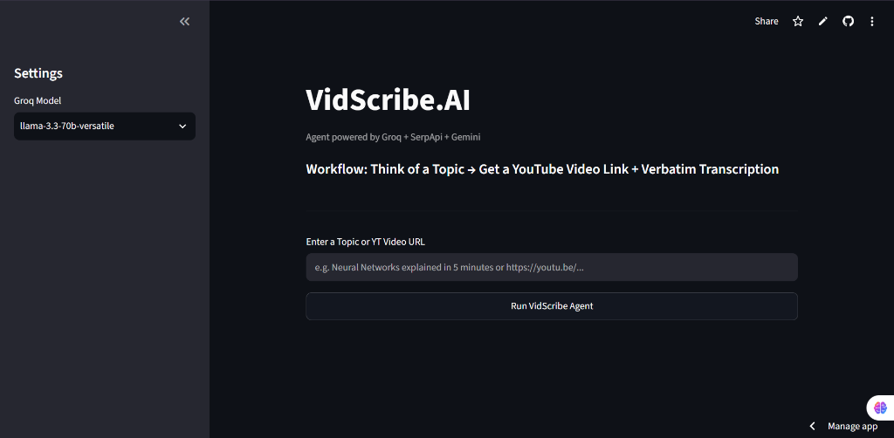
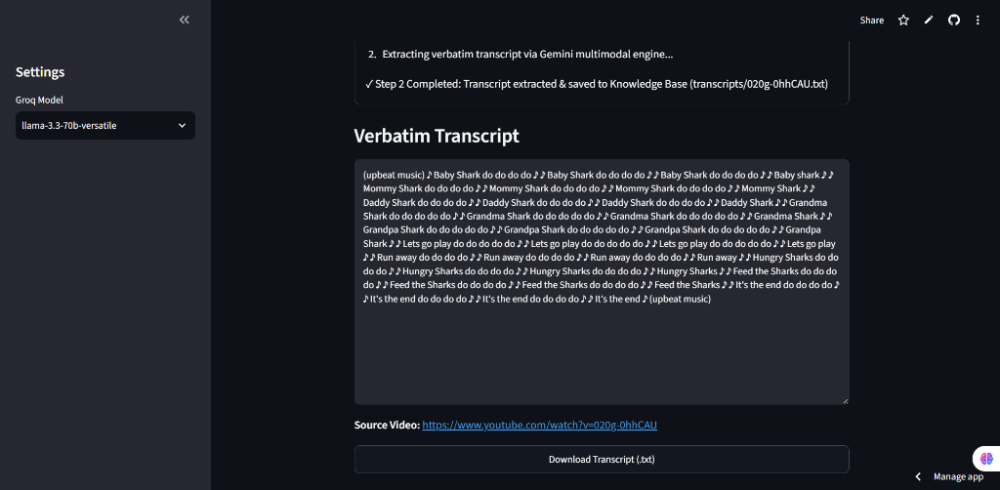
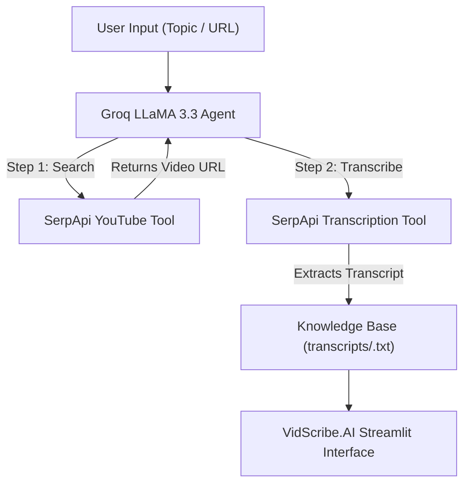

# 🎬 VidScribe.AI — YouTube Video Search & Transcription Agent

 


An autonomous AI Agent built with **Groq API**, **SerpApi**, and **Streamlit**. VidScribe.AI searches YouTube by topic (or direct URL), transcribes spoken audio using SerpApi, stores transcripts in a local Knowledge Base, and provides a clean, responsive web interface.

---

## 🌐 Live Demo

- **Live App:** [https://vidscribe-ai.streamlit.app/](https://vidscribe-ai.streamlit.app/)
- **Demo Video:** *(Add video link / GIF here)*

---

## 📸 Screenshots

### Main Interface & Input


### Verbatim Transcript & Download


---

## ✨ Key Features

- 🔍 **Topic-to-Video Search**: Instant YouTube video retrieval via SerpApi.
- 🎙️ **Verbatim Transcription**: Audio transcription extraction via SerpApi's YouTube Video Transcript engine.
- 🧠 **Deterministic Agent Tool-Chaining**: Powered by Groq `llama-3.3-70b-versatile` with forced `tool_choice`.
- ⚡ **Real-Time Execution Checklist**: `st.status` widget for live step-by-step feedback.
- 💾 **Knowledge Base Storage**: Auto-saves transcript files locally (`transcripts/<video_id>.txt`).
- 📥 **One-Click Download**: Integrated `.txt` transcript download button.
- 🎨 **Minimalist Design**: Clean typography with dark/light Streamlit theme support.

---

## 🛠️ Tech Stack

| Technology | Category | Role / Purpose |
| :--- | :--- | :--- |
| **Groq API** | Agent Orchestration | Runs `llama-3.3-70b-versatile` for tool-calling logic |
| **SerpApi** | Search & Transcription | Fetches YouTube video links and extracts verbatim transcripts |
| **Streamlit** | Web Interface | Interactive frontend with real-time status updates |
| **Python** | Core Language | Application backend and agent execution logic |

---

## ⚙️ How It Works

1. **User Request**: The user enters a search topic (e.g. *"Neural Networks explained"*) or pastes a direct YouTube URL.
2. **Tool Selection**: Groq LLaMA inspects the input and invokes `search_youtube_video(query)`.
3. **Video Ingestion**: SerpApi fetches matching YouTube video metadata, title, and exact URL.
4. **Transcription**: The agent invokes `transcribe_video(video_url)`, extracting verbatim audio via SerpApi.
5. **Knowledge Base Storage**: Transcripts are automatically saved to `transcripts/<video_id>.txt` in UTF-8 format.
6. **Output Delivery**: Streamlit renders real-time `st.status` execution checklists, verbatim transcript text, source link, and instant `.txt` download button.

---

## 🏗️ Project Architecture



---

## 📂 Project Structure

```text
YT Video Search & Transcription Agent/
├── .env                  # API keys (Groq, SerpApi)
├── .gitignore            # Git exclusion rules
├── README.md             # Project documentation
├── agent.py              # Groq tool-calling agent logic
├── app.py                # Streamlit web application
├── config.py             # App configuration & constants
├── requirements.txt      # Python dependencies
├── tools.py              # SerpApi tool implementations
├── docs/                 # Documentation assets
│   └── assets/           # UI screenshot images
└── transcripts/          # Knowledge base storage directory
    └── .gitkeep
```

---

## 💻 Local Setup & Installation

1. **Clone Repository**:
   ```bash
   git clone https://github.com/Arslan-Codes097/YouTube-Video-Search-Transcription-AI-Agent-.git
   cd YouTube-Video-Search-Transcription-AI-Agent-
   ```

2. **Install Dependencies**:
   ```bash
   pip install -r requirements.txt
   ```

3. **Set Up `.env`**:
   Create a `.env` file in the root directory:
   ```env
   GROQ_API_KEY=your_groq_api_key
   SERPAPI_KEY=your_serpapi_key
   ```

4. **Run Streamlit Application**:
   ```bash
   streamlit run app.py
   ```

---

## 👤 Author

Developed with passion by **Arslan Babar**:
- **GitHub:** [@Arslan-Codes097](https://github.com/Arslan-Codes097)
