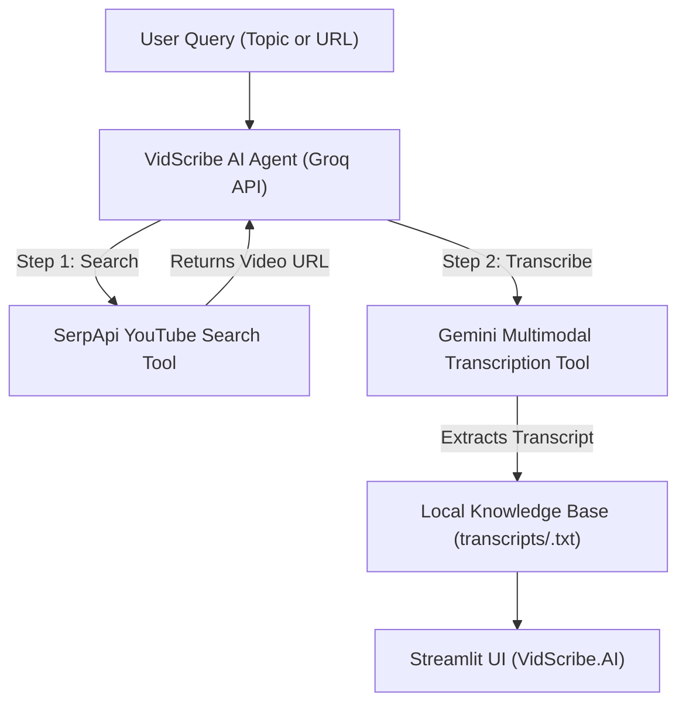

# VidScribe.AI - YouTube Video Search & Transcription Agent

VidScribe.AI is an autonomous AI Agent built with **Groq API**, **SerpApi**, **Google Gemini**, and **Streamlit**. It allows users to search YouTube by topic (or paste a direct video URL), automatically extracts verbatim transcriptions using multimodal AI, stores transcripts in a local Knowledge Base, and provides a clean interactive web interface.

---

## Key Features

- **Topic-to-Video Search**: Uses **SerpApi** (YouTube Search Engine) to find relevant YouTube video links for any search topic.
- **Multimodal Video Transcription**: Uses **Google Gemini** (with caption engine fallback) to extract verbatim transcriptions without AI commentary or hallucinated summaries.
- **Deterministic Tool Chaining**: Powered by **Groq API** (`llama-3.3-70b-versatile` & `openai/gpt-oss-120b`) enforcing forced `tool_choice` execution.
- **Real-Time Execution Status**: Displays interactive `st.status` step-by-step checklist updates as the agent executes tools.
- **Knowledge Base Persistence**: Automatically saves transcript files to `transcripts/<video_id>.txt`.
- **One-Click Download**: Integrated button to download `.txt` transcript files directly.
- **Strict Design Standards**: Clean, modern typography complying with strict UI rules (zero emojis, clean contrast, native light/dark theme support).

---

## Tech Stack

- **Agent Orchestration**: Groq API (`llama-3.3-70b-versatile`)
- **Video Search Tool**: SerpApi (`engine="youtube"`)
- **Transcription Tool**: Google Gemini API (`google-genai`) + `youtube-transcript-api` fallback
- **Frontend UI**: Streamlit
- **Language**: Python 3.10+

---

## Project Architecture



---

## Local Installation & Setup

1. **Clone the Repository**:
   ```bash
   git clone https://github.com/Arslan-Codes097/YouTube-Video-Search-Transcription-AI-Agent-.git
   cd YouTube-Video-Search-Transcription-AI-Agent-
   ```

2. **Install Dependencies**:
   ```bash
   pip install -r requirements.txt
   ```

3. **Configure Environment Variables**:
   Create a `.env` file in the root directory:
   ```env
   GROQ_API_KEY=your_groq_api_key
   SERPAPI_KEY=your_serpapi_key
   GEMINI_API_KEY=your_gemini_api_key
   ```

4. **Run the Streamlit Application**:
   ```bash
   streamlit run app.py
   ```

---

## License

MIT License
